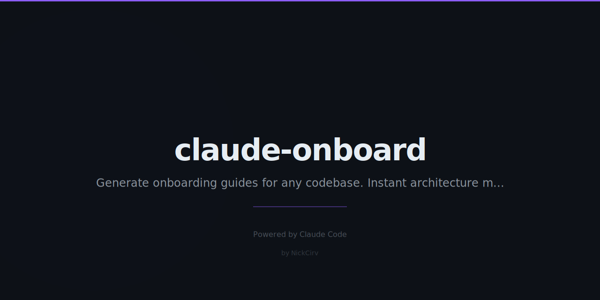

# claude-onboard



AI-powered repo onboarding for new devs. Point at any codebase, get an instant architecture guide powered by Claude.

## Usage

```bash
# Analyze current directory
npx claude-onboard

# Analyze a local path
npx claude-onboard ./my-project

# Clone + analyze a remote repo
npx claude-onboard https://github.com/user/repo

# Save guide to markdown file
npx claude-onboard --output guide.md

# Remote repo + save to file
npx claude-onboard https://github.com/facebook/react --output react-guide.md
```

## What It Generates

- **Architecture Overview** — what the project does and how it's structured
- **Tech Stack** — detected frameworks, tools, and versions
- **Key Files Map** — the 8-12 files every new dev should know
- **Getting Started** — exact commands to run the project locally
- **Common Tasks** — how to add features, run tests, deploy
- **Gotchas** — things that'll trip up a new dev

## Setup

```bash
npm install -g claude-onboard
```

Or run without installing:

```bash
npx claude-onboard
```

Set your Anthropic API key:

```bash
export ANTHROPIC_API_KEY=sk-ant-...
```

## Supported Stacks

Detects and understands:

| Language | Frameworks |
|---|---|
| JavaScript/TypeScript | Next.js, React, Vue, Svelte, Astro, Express, Fastify, Hono |
| Python | Django, FastAPI, Flask |
| Go | Gin, Echo, Fiber, Chi |
| Rust | Actix Web, Axum, Warp |
| Ruby | Rails, Sinatra |
| Java/Kotlin | Spring Boot, Quarkus |
| PHP | Laravel, Symfony |

Also detects: Prisma, Drizzle, Auth.js, Clerk, Tailwind, Vitest, Jest, Playwright, Docker, GitHub Actions, Render, Vercel, Fly.io, and more.

## Options

```
Arguments:
  target                 Directory path or GitHub URL (default: current directory)

Options:
  -o, --output <file>    Save guide to markdown file
  -v, --verbose          Show verbose output including token counts
  -V, --version          Output version number
  -h, --help             Display help
```

## How It Works

1. Scans directory structure (up to 4 levels deep, skips node_modules/.git/etc)
2. Reads key files: package.json, README, config files, entry points
3. Detects tech stack from dependency manifests
4. Sends a structured summary to `claude-sonnet-4-6`
5. Formats the response as readable terminal output or markdown

No entire files are sent — only snippets and key configs. Typical analysis uses ~2,000-4,000 input tokens.

## License

MIT — by [NickCirv](https://github.com/NickCirv)
