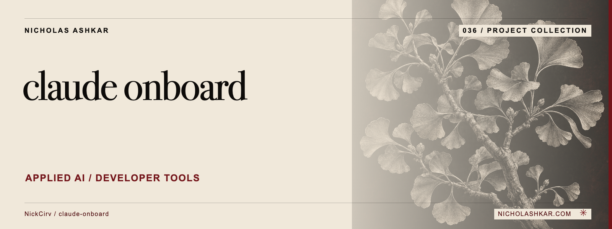

# claude-onboard

Builds an onboarding guide by sending selected repository structure and files to Claude.


<a id="usage"></a>

<a id="analyze-current-directory"></a>

<a id="analyze-a-local-path"></a>

<a id="clone--analyze-a-remote-repo"></a>

<a id="save-guide-to-markdown-file"></a>

## What it does

- Directory or GitHub URL input.
- Stack/entry-point detection.
- Terminal presentation.
- Optional Markdown output.


<a id="install"></a>

<a id="setup"></a>

## Quickstart

Prerequisites: Node.js `>=20` and npm; Git is also used by the implementation. The checkout below pins the source used for this documentation.

```sh
git clone https://github.com/NickCirv/claude-onboard.git
cd claude-onboard
git checkout 9d33f1639bc9c4ef81698d7a073c70307bfc7eb0
npm install
node bin/onboard.js .
```

**Expected behavior (illustrative, not captured):** With ANTHROPIC_API_KEY set, returns a generated guide for the local project.

Examples are source-inspected, **not runtime-tested**. See the research record for verification gaps.

## Boundaries and data

Selected source leaves the machine for Anthropic. Scanning and file selection are bounded; generated architecture explanations can be incomplete. Repository URLs are cloned locally.

## Development

The manifest defines `npm test` as:

```sh
node --test
```

The captured suite is a smoke check, not end-to-end behavior coverage. Examples include “entry is valid JavaScript”, “--help exits 0”. Tests were not run for this documentation revision.

See [implementation and command reference](docs/REFERENCE.md) for the package scripts and inspected interfaces, and [research record](docs/RESEARCH.md) for the pinned source, document decisions and unresolved checks.

## License and contact

See [LICENSE](LICENSE) for the original terms and attribution. Legal text is unchanged.

[Nicholas Ashkar](https://nicholashkar.com/) · [Discuss a project](https://nicholashkar.com/#oxblood-contact)
